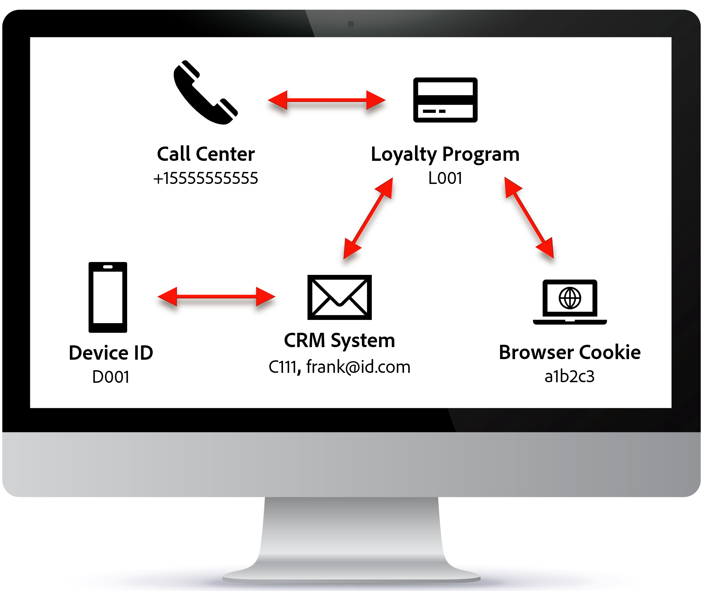

---
title: Person-based Identity Graphs
description: Person-based Identity Graphs
doc-type: article
exl-id: e80a3381-a0f4-4091-8cbb-cb6ae16192d9
---

As discussed previously the Identity Service is all about the identities that can be used for creating person-based profile's. An identity is a value that is **unique** to a singular person.

Every data source typically contains at least one unique identity and optional other identities (some person-based some not).  Identity Graph's purpose is to record the relationships between those various person-based identities and data sources. This ensures that if you ask a question about the loyalty member L001 or the crm\_id C111 you always get the same profile in your response.

>[!NOTE]
>Identities used within the Identity Graph are deterministic. In other words, an identity cannot probably be Eric or Kevin. It must uniquely identify Eric or Kevin (i.e., a singular person)

