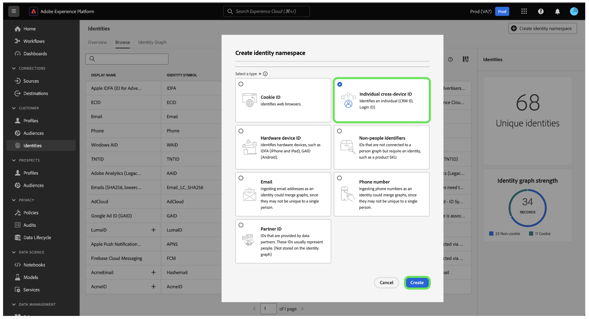

---
title: Creating Identity Namespaces
description: Creating Identity Namespaces
doc-type: article
exl-id: 95333617-698e-4419-8b26-6b28d814bbf1
---

# Overview

Adobe Experience Platform provides several identity namespaces out-of-the-box that are available to all organizations (known as standard namespaces). You also have the ability to create your own custom namespaces in the system where the standard namespaces are not an option.

*To create an identity namespace you need to provide the following information:*

- **Display name: **a user-friendly name for a given namespace
- **Identity symbol: **a unique code to represent the namespace (this is used internally by Identity Service)
- **Identity type:** defines if the identity can participate in the identity graph
- **Description:** (Optional) any supplemental information you wish to provide for the given namespace

# User Interface Creation Steps

**Step 1**

**Step 2**

*A few key points to keep in mind:*

- Namespaces that you define are private to your organization and require a unique identity symbol in order to be created successfully.
- Once a namespace has been created, it cannot be deleted and its identity symbol and type cannot be changed.
- Duplicate namespaces are not supported. You cannot use an existing display name and identity symbol when creating a new namespace.

