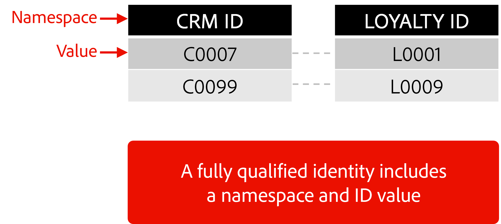

# Data vs. Identities

If you look at the graphic, you see two rows and two columns of data. Assume for the moment that each row represents a single profile containing two identities.

If you were asked to identify which column contains CRM identities vs. Loyalty identities how would you do this? Would you assume that values starting with C mean CRM and those starting with L mean Loyalty? Do you want to assume the identities of a person?

## Introducing Identity Namespaces! 

A fully qualified identity in Identity Service includes both an identity namespace and identity value. 

Simply put, an identity namespaces provides additional context about the identity value to ensure its properly distinguished from other identities at the time of processing into the Identity Graph.

