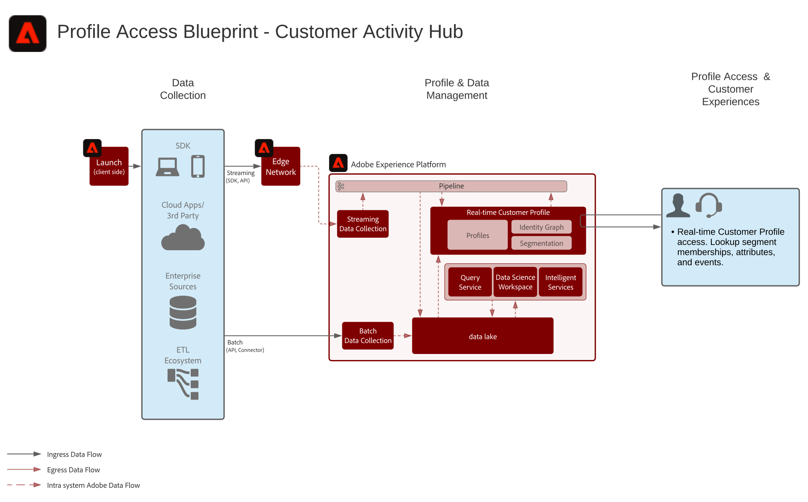

# Profile Lookup blueprint

## Description

Profile Lookup blueprint details the ability for external applications to access Adobe Experience Platform’s Real-time Customer Profile. This is performed by the external application performing an API get call of a single or multiple profiles within AEP’s profile store.

The result of the get call is the full unified profile as represented in AEP's real-time profile system. This means that attributes, events, segment memberships, and model driven features that are stored in the profile can then be accessed and utilized by applications external to Adobe.

A good example is using the Profile Lookup capability to surface richer context about a customer when they call into the call center for support. Support agents can have visibility into the recent campaigns, the customer lifetime value, or the propensity to churn as a few examples. 

Another example would be using the profile lookup during an agent supported sales process so that the sales agent can have additional context or insight into the customer they are selling to.

Note that the current latency supported by the profile lookup API is ~ 500ms, making this approach not suitable for integration of the profile with real-time decision engines. For this capability the Edge Profile which has a latency <100ms must be utilized. Note that the Edge Profile capability is still in development.

## Architecture

## Guardrails

* [Standard Profile Guardrails](https://docs.adobe.com/content/help/en/experience-platform/profile/guardrails.html)

## Implementation Steps

1. Datasets and schemas configured
2. Profile configured – schema and dataset configured for profile, merge policy and identities configured
3. Data collected into platform and processed to profile
4. Entity API leveraged to lookup profile attribute – either from the record entity or the experience event entity

## FAQs & Documentation

* [Product Description](https://helpx.adobe.com/legal/product-descriptions/adobe-experience-platform0.html)
* [Product Documentation](https://experienceleague.adobe.com/docs/experience-platform/profile/home.html?lang=en)
* [Profile Guardrails](https://docs.adobe.com/content/help/en/experience-platform/profile/guardrails.html)
* [Profile Lookup API](https://www.adobe.io/apis/experienceplatform/home/api-reference.html)
