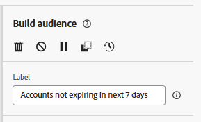
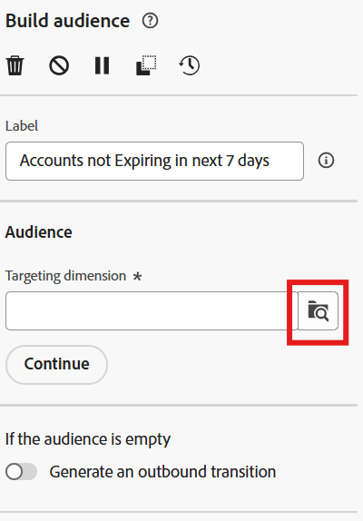
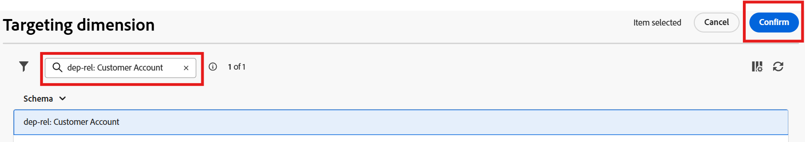
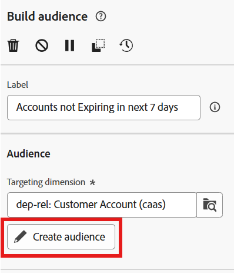
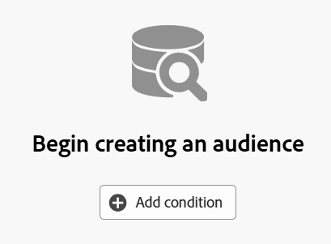
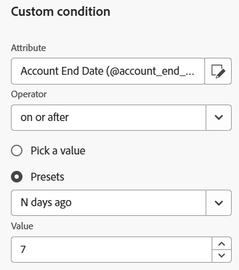
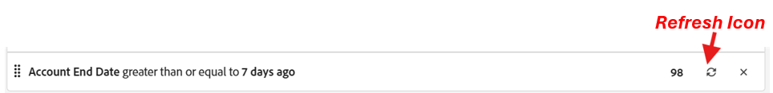
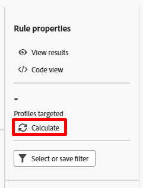
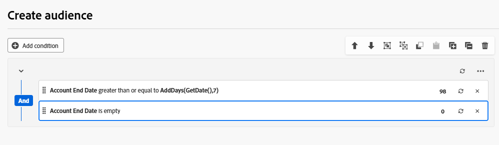
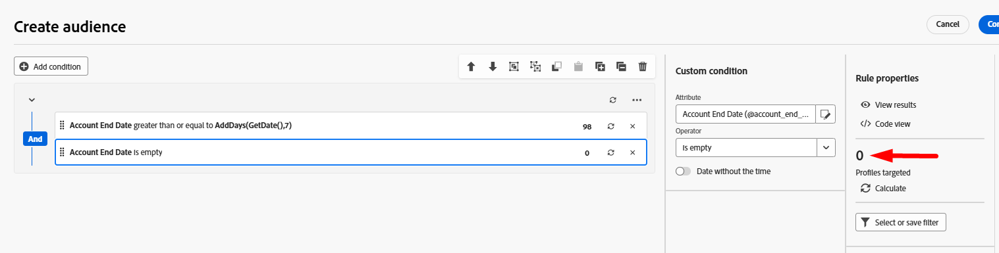

---
title: Build Audience #1
description: Build Audience #1
doc-type: article
exl-id: 3d475cd3-1258-4fe7-bf3d-20e3fcc13a76
---

For the first audience you have the goal of finding all customer accounts who are not expiring in the next 7 days.

# Add Build Audience Activity

To start do the following:

1. On the empty canvas click the **plus symbol** and then click on the** Build audience** activity to add it to the workflow

2. In the right rail you see the Build audience properties. Update the Label to state the following: `Accounts not expiring in next 7 days`

# Select Targeting Dimension

The next step is to select the **Targeting dimension** (i.e. what table you want to query). Do the following steps:

1. Click on the **search icon** in the Targeting dimension box

2. On the popup, search for and select the table named **dep-rel: Customer Account **and then click the **Confirm **button.

>[!NOTE]
>**Note: **Always remember the **targeting dimension** of each audience you create. You’ll learn its significance in the next steps.

>[!NOTE]
>Note the parentheses on the targeting dimenssion -> *(caas)*. This is just a namespace applied to the tables within the relational store and stands for Campaign as a Service :)

# Configure the Audience

Now that you have selected your targeting dimension (what relational schema you are going to query) you can start creating your definition. For this audience you want to find all the customer accounts who are not expiring in the next 7 days

## Create Audience

1. In the right rail click on the **Create Audience **button

2. Next click on the **Add condition** button

## Create Condition(s)

Now its time to write the logic of the audience using the attributes found in the schema. The goal is to find all customer accounts who are not expiring in the next 7 days. You will need to use the Account End Date field to create two conditions:

- Condition #1 --> Account End Date is not expiring in the next 7 days
- Condition #2 --> Account End Date is not null/empty

### Create condition #1 

1. Using the following information and then click on the refresh icon to view the count.
   - **Attribute**:  `Account End Date`
   - **Operator**:  `on or after`
   - **Presets**:  `N days ago`
   - **Value**:  `7`

2. Click **Refresh **icon to view the qualifying counts on the condition. 

>[!TIP]
>You should see a result of 98 if you've built the condition correctly

### Create condition #2 

1. Clicking the** Add condition** button and using the following information:
   - **Attribute**:  *Account End Date*
   - **Operator**: *is not empty*

2. **Click **on the **refresh **icon to calculate the condition.

>[!TIP]
>You should see a result of 100 if you've build the condition correctly

>[!NOTE]
>Note the use of the AND operater in the group. Whether you build this in a single group like shown or multiple groups the AND is important because it tells Orchestrated Campaigns both conditions must be true.

# Verify counts

1. Click on the **Calculate icon** found in the right rail under the heading Profiles targeted to get an exact estimate of the audience size. You should see 98 as the final count.

>[!NOTE]
>Notice how each individual condition returned a different number (condition #1 --> 98 and condition #2 --> 100) but the final audience size was the lesser of the two conditions.  This is because of that AND operater.

2. If you see final count of **98 **click the **Confirm **button in the top right of the screen and then click the **Save **button in the top right to save your work.

# Challenge

What is the final audience count if you switched the last condition to say Account End Date is empty?

:::ExpandableHeading
## Answer

Its zero :) Do you know why?

:::

