---
title: Setup Relational Schema and Dataset
description: Setup Relational Schema and Dataset
doc-type: article
exl-id: 4dd1d41c-aaeb-4505-bba3-29887aedbc03
---

This lab covers Relational schema and dataset creation along with loading data for use in Orchestrated Campaigns. The DDL approach will be used for schema and dataset creation.

# 1 - Prerequisite

Download the two files required for the lab to the local work station

1. DDL:

>[!NOTE]
>Download **OC_MDL_Customer.ddl** from your lab administrator.

2. CSV:

>[!NOTE]
>Download **OC_MDL_CustomerData.csv** from your lab administrator.

# 2 - Relational Schema and Dataset using DDL

1. In the AEP UI, navigate to Schemas on the left rail

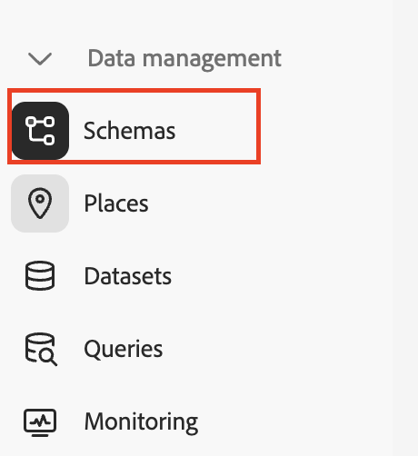

2. Click on **Create schema** and select **Relational**

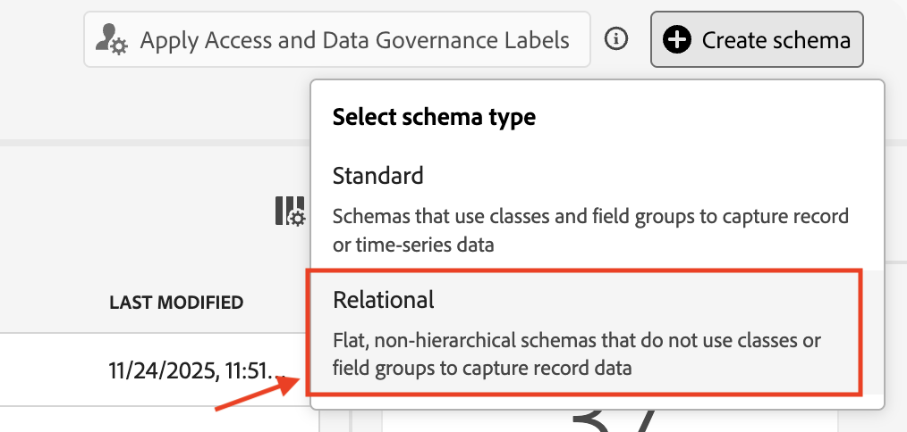

3. Select **Upload DDL file** option, click on the **Choose files** button to use the DDL file downloaded in the Prerequsite section. 

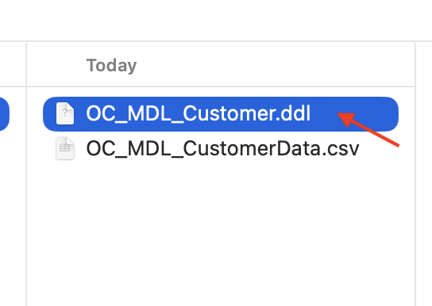

4. Click on **Next**

5. Mark the fields used as Identity and Versioning. In this case, the `customer_id` and the `lastmodified` columns will be used for this respectively. 

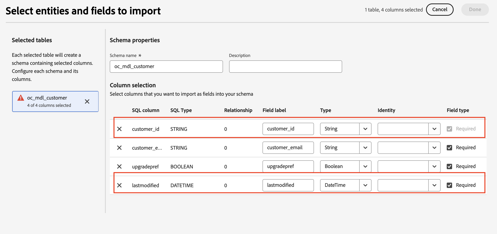

6. For `customer_id`, from the drop down select `customerID` as Identity 

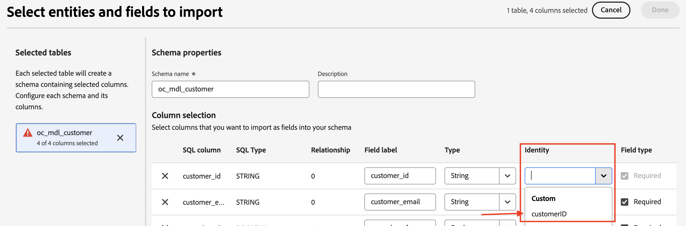

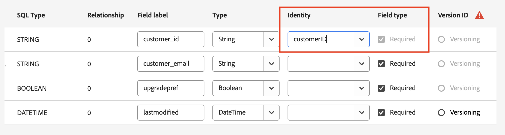

7. For `lastmodified` row, select the `Versioning` option

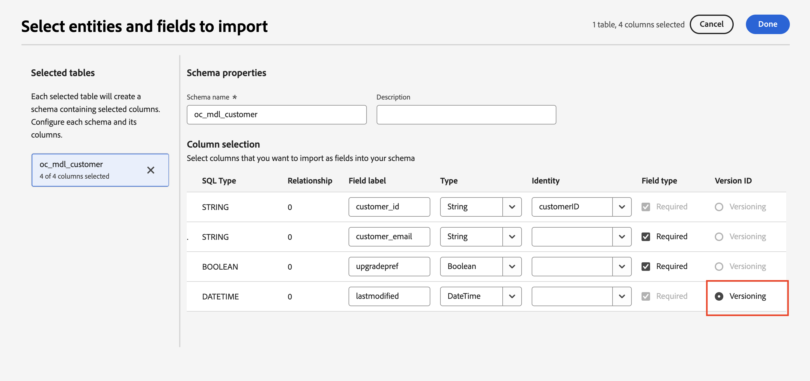

8. Click on **Done**

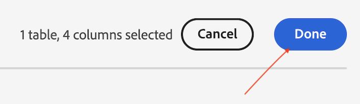

9. The visual representation of the schema is presented, click on **Save**

10.  The dialog confirming the start of the DDL processing is presented, click on **Open jobs** button to view the progress

11. Refresh the page. The entire DDL processing steps can be traced here and goes through four steps of :
    1\) Validation 
    2\) Schema creation 
    3\) Dataset creation 
    4\) Dataset enablement for Orchestrated Campaigns

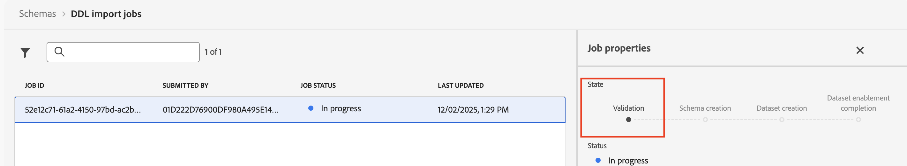

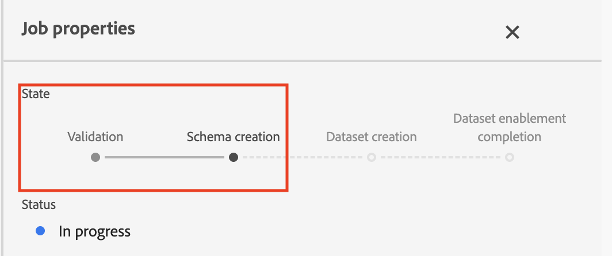

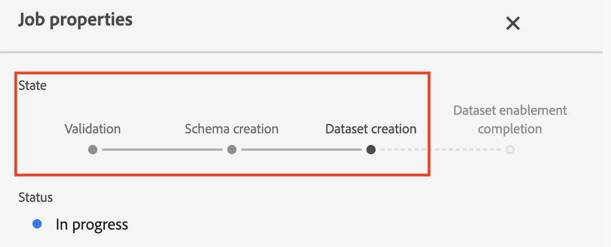

:::Paragraph{indent="2"}
The DDL processing is complete and the schema and dataset has been created successfully.
:::

1. Navigate to **Dataset** section on the left rail 

:::Paragraph{indent="2"}
Search for the `oc_mdl_customer` dataset just created in the above step
:::

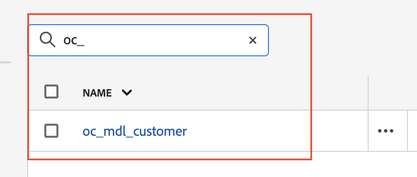

:::Paragraph{indent="2"}
View the dataset details and also that it is enabled for Orchestrated Campaign
:::

>[!TIP]
>Using the DDL approach, the schema, dataset have been successfully created and the dataset has also been enabled for **Orchestrated Campaigns**.

# 3 - Data ingestion

Data will be ingested into the dataset created above using the AEP UI and the local CSV file downloaded earlied in the Prerequsite section

1. Navigate to **Workflows** on the left side rail and then to **Map CSV to XDM** **schema**

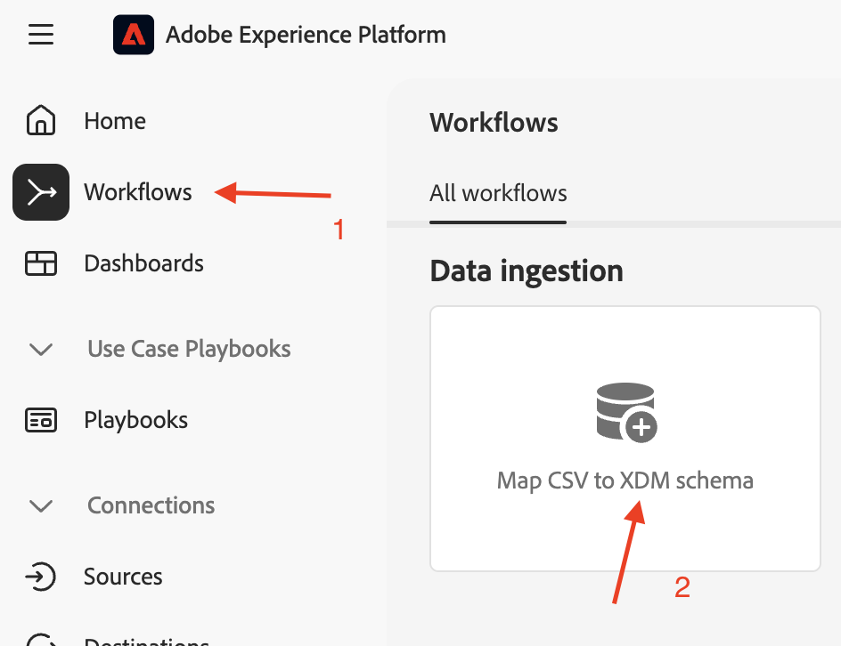

2. Click on **Launch**

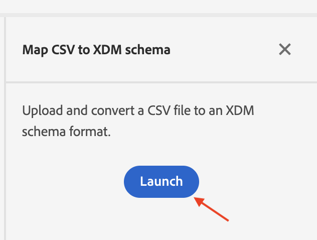

3. Toggle **Enable change data capture** to view the list of datasets related to Relational schemas. Select the `oc_mdl_customer` dataset created earlier from the drop down and click on **Next** 

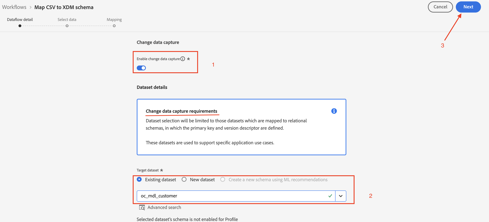

4. Click on Choose files to upload local file (use the CSV file downloaded in the Prerequsite section)

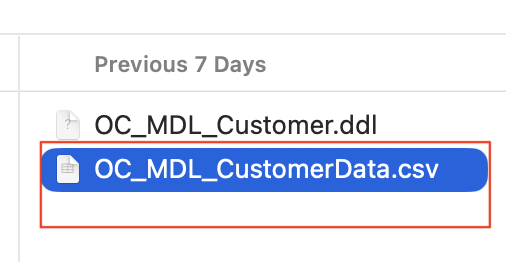

5. Once the file is loaded, view/verify the data and click on **Next**

6. The auto-mapping performs the CSV fields to the Schema fields mapping

>[!WARNING]
>It has been observed that sometimes the mapping could be incorrect. This can be fixed by manually adding the correct mappings and validating them. The following steps will help fix that.
>
>If mappings are all correct and no errors are encountered, please move to the next step.

:::Paragraph{indent="2"}
Delete the incorrect mappings:
:::

:::Paragraph{indent="2"}

:::

:::Paragraph{indent="2"}
Once the mappings are deleted, click on on **Validate**
:::

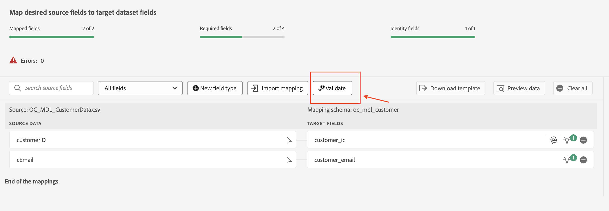

:::Paragraph{indent="2"}
The UI will complain of missing mappings, which needs to be manually added
:::

:::Paragraph{indent="2"}
Click on **New field ****type** and select **Add new field**
:::

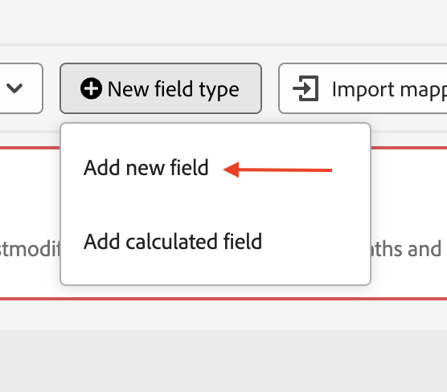

:::Paragraph{indent="2"}
Choose the `upgradePref` from the Source Schema (CSV) mapping and click on **Select**
:::

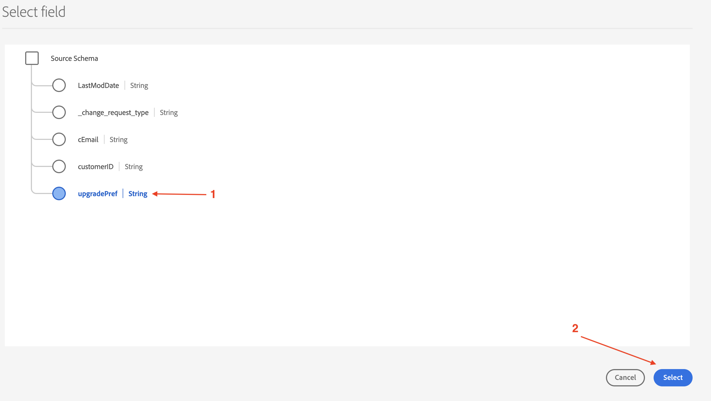

:::Paragraph{indent="2"}
Click on the **Map target field** under **TARGET FIELDS**
:::

:::Paragraph{indent="2"}

:::

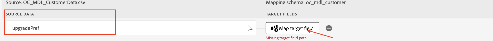

:::Paragraph{indent="2"}
Select `upgradepref` attribute from the Schema structure
:::

:::Paragraph{indent="2"}
The input field `upgradePref` has been mapped to `upgradepref` attribute from the Schema. 
:::

:::Paragraph{indent="2"}
Map the remaining field. Click on **New field type** and select **Add new field** to add
:::

:::Paragraph{indent="2"}
Choose the `LastModDate` from the Source Schema (CSV) mapping and click on **Select**
:::

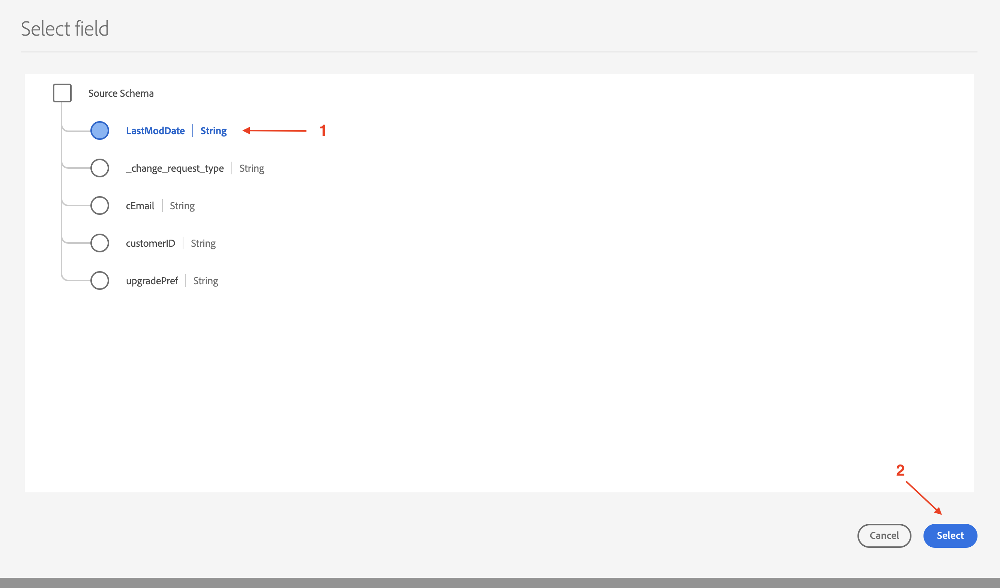

:::Paragraph{indent="2"}
Click on the **Map target field** under **TARGET FIELDS**
:::

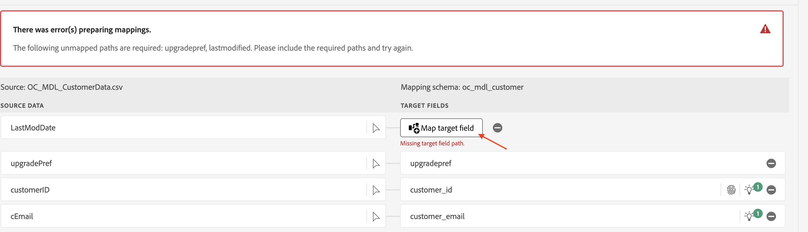

:::Paragraph{indent="2"}
Select `lastmodified` attribute from the Schema structure
:::

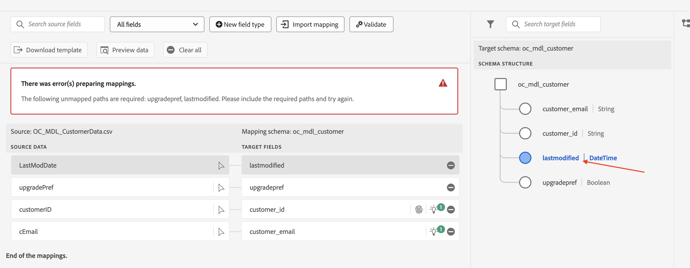

:::Paragraph{indent="2"}
Confirm all the mappings and click on **Validate** to remove all mapping errors
:::

7. If errors have been cleared, click on **Finish** to start the ingestion process

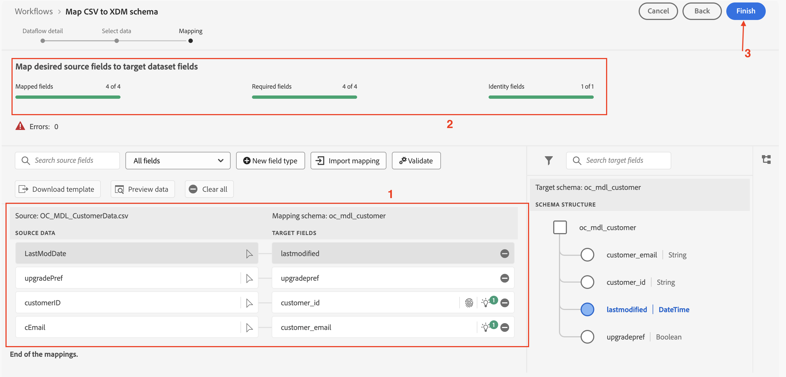

8. Once the ingestion process is initiated, refresh the Dataflow activity page for the dataset to see the details. Once completed, the dataflow status is updated to **Success** 

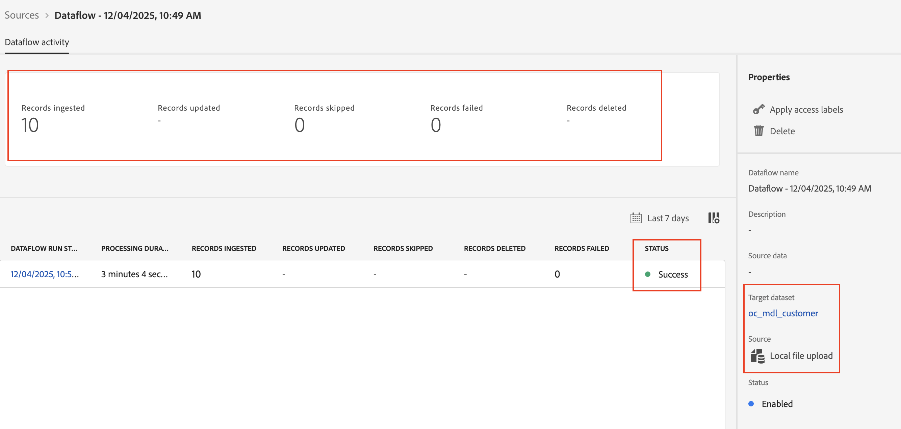

>[!TIP]
>Congratulations! the schema and the corresponding dataset have been created and data has been successfully ingested into the dataset.

# Bonus: Graphical view of the schema and relationships

As new Relational schemas get created and relationships defined, the AEP UI provides an option to have a graphical view of these schemas and their relationships:

1. In the AEP UI, navigate to Schemas on the left rail

2. Click on the Relationships tab

3. Click on **View relationships diagram**

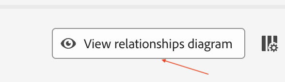

4. Click on **Select Schemas**

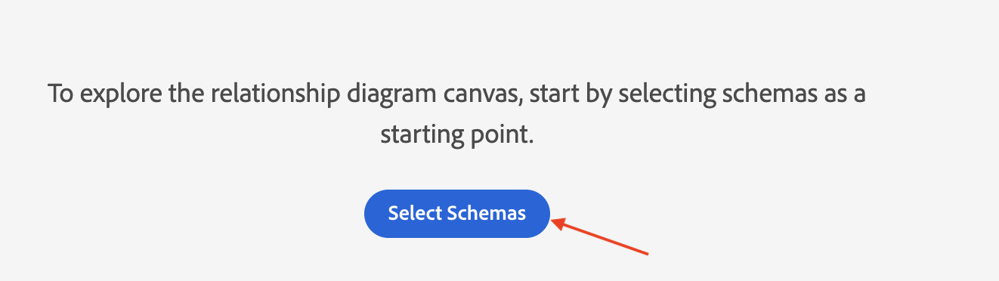

5. Select few/all of the schemas and click on **Confirm**

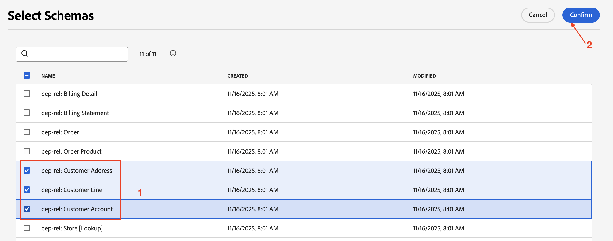

6. The graphical view of the Schema relationships are renderred. Click on **Back** to exit

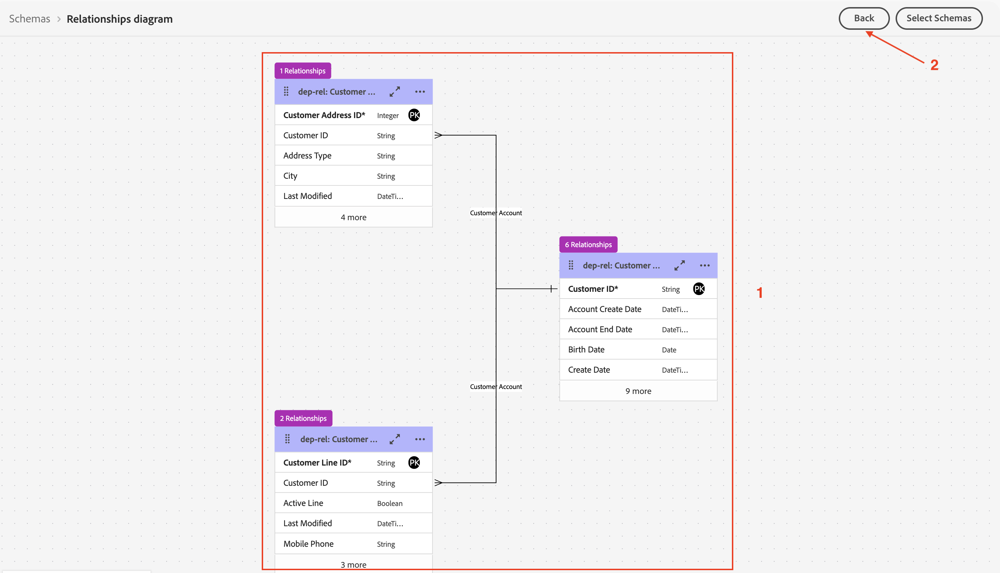

>[!TIP]
>Congratulations! this concludes the Relational Schema+Dataset setup step in the lab.

