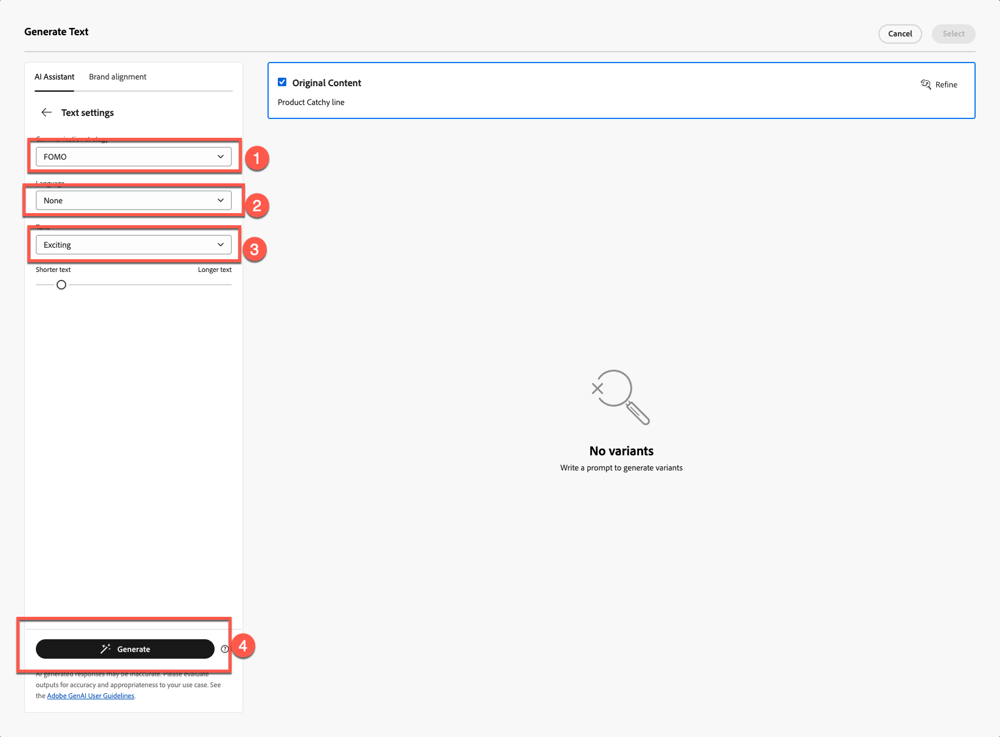
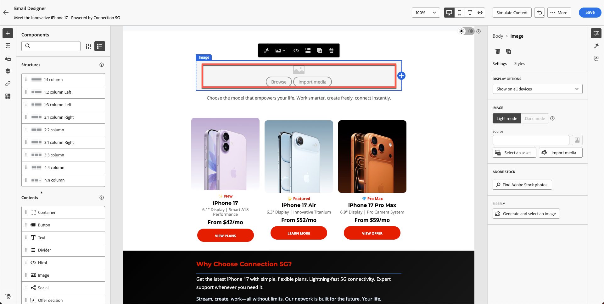
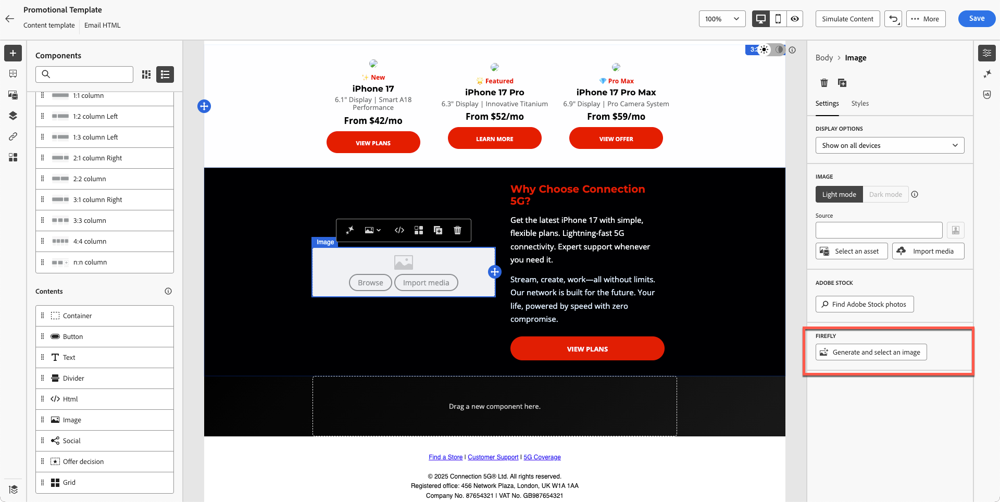

---
title: AI Assistant & Content Personalization
description: AI Assistant & Content Personalization
doc-type: article
exl-id: 1f30c920-7b2b-4343-b663-ebbed1ae4709
---

**Purpose:** Learn how to use Adobe Journey Optimizer’s AI Assistant to generate subject lines, refine email text, adjust tone, and create on-brand Firefly images directly inside the email designer.

## Learning Objectives

By the end of this module, you will be able to:

1. Use the AI Assistant to generate subject lines and pre-headers.
2. Refine hero text, descriptions, tone, and messaging.
3. Apply AI-driven rephrasing, summarisation, and tone adjustments.
4. Generate images using Adobe Firefly with reference style and brand settings.
5. Replace placeholders with generated images inside your email design.

## Introduction

The AI Assistant in AJO helps you build smarter, on-brand content.
It can:

- Generate subject lines
- Improve existing text
- Adjust tone and clarity
- Create branded images using Firefly
- Ensure everything aligns with Connection 5G guidelines

For this exercise, we will improve the email that we have created using the AI Assistant. 

>[!WARNING]
>**Note: **The AI Assistant is **non-deterministic**, which means it may generate slightly different content each time it is used. What you see during your practice may not exactly match the screenshots or examples in this guide. That’s okay—focus on learning the process and concepts rather than expecting identical results.

## Create Email Subject Line Using AI Assistant

1. Go back to the Campaign by clicking the back button or edit the email you created in the previous module. (from previous step, you can click on settings tab on right hand side)
2. Click on Email Container > Click on Edit Email button. 
3. Click on the content tab, and then click on Email body
4. Select the **Subject Line** field.
5. Click the **AI Assistant icon**. (see below)

4. You will notice that Brand Guideline is selected by default. 
5. Enter the prompt:

:::BlockQuote{indent="1"}
We are launching iPhone 17 and want a subject line to be catchy
:::

1. Press **Generate**.
2. Review the four variants generated.
3. Choose the variant with the best alignment score and click **Select**.

>[!WARNING]
>Note: Your results may be completely different from the lab guide, so do not need to worry. Select what you think is a right title and continue with the lab. 

***

# Improve Hero Title & Description

1. Open email by clicking on "Edit email body" button. 

2. Click on the **Product ****Catchy ****line** heading.
3. Open AI Assistant by clicking on **Generate and select a text**

4. Select **Connection 5G Brand Guidelines** from the dropdown.

4. Prompt:

:::BlockQuote{indent="1"}
*Write a bold, attention-grabbing headline for the iPhone 17 launch. Keep it under 10 words*
:::

6. Click on Text settings to change the tone and communication strategy. Change Communication strategy to **FOMO (Fear of Missing Out)**, Language to **English **and Tone to **Exciting**. Use shorter version by scalling down the dial. 

7. Click the **Generate** button
8. Review and select the best version, 
9. If your text is long then use the slier to **"shorter text" **and regenerate the text. 

10. Once you are happy with the text click on **Select**

## Description prompt

This time we want to test how AI can help to find issues. 

1. Select the text below which is templaed text and has no meaning. 

2. Click on evaluate button as shown below. 

3. Your original content will be automatically selected with your brand, as shown in Steps 1 and 2 below. Click the **Evaluate **button to proceed.

4. As expected, you will notice many errors that violate brand guidelines. Although these could be corrected using AI, in this case we will not revise the existing materials. Instead, we will leave them as they are and create new content from scratch that fully aligns with brand standards.

5. Lets use new paragraph that is generated for you using AI using the prompt below. You can use same approach for decription text using the prompt below.

:::Paragraph{indent="1"}
Prompt:
:::

:::BlockQuote{indent="1"}
*Write a compelling product description for the new iPhone 17. Highlight its most impressive features, such as advanced camera, battery life, and performance. The tone should be premium, exciting, and easy to understand for a wide audience. Keep it under 3 sentences.*
:::

In order to save time I have already created the text for you. Copy and paste below to get your text.

:::BlockQuote
Discover the iPhone 17™ - featuring an advanced camera for stunning photos, all-day battery life to keep you going, and lightning-fast performance that keeps you ahead. Don’t miss out on this innovative experience.
:::

Your email should look like as shown below.  

***

# Add a Firefly-Generated Image

Until now, we have tested AI Assistant on Subject line and Text. What about images? 

Before we dive into AI image generation, let us see what types of experiences we can build. 

We understand that we have the year of birth of the profile. One of the experiences we can do is to create a block with different variants. With Adobe Journey Optimizer, this is possible and one of the biggest advantages of having Adobe Experience Platform as your base. We will cover experimentation in our next module, but first, let us prepare the block

1. Drag an **Image** component to the left-hand side column below iphone 17 Family block.

2. Click outside then select the image placeholder. (Make sure you click on the image otherwise you wont see Firefly option)

3. Under **Firefly**, click **Generate and select image**.

## Upload Reference Image

1. Turn on **Reference Style**.
2. Select **Connection 5G Brand Guideline **on brand selection

3. Click on Upload Image

3. Select reference.jpg frmo the toolkit folder

4. Add Image Prompt
   `Portrait-oriented image of a confident man in his early to mid-40s, standing alone at night in a neon-lit urban street, focused on his smartphone. Cinematic cyberpunk-inspired city atmosphere with colorful LED signs, cool blue and warm orange lighting, shallow depth of field, soft bokeh lights in the background. Modern lifestyle, tech-savvy mood, realistic skin tones, high contrast, photorealistic, professional lighting, ultra-detailed`.

## Choose Image Settings

Choose your **Image settings**:

5. Choose the following settings:
   - **Ratio:** Landscape (4:3)
   - **Content type:** Photo
   - **Colour & tone:** Cool tone
   - **Lighting: **Dramatic Lighting
6. Press **Generate** button 

***

# Select & Insert the Generated Image

1. Review Firefly results by check all images generated.

2. Click **Select** for your desired chosen image.

3. If prompted with an upload modal, click **Next**.

4. Then click **Import**.

# Finalise Block Design

I have applied rounded border radius by 10 just to make it look modern. If you have time you can do that. 

After few iterations and variation we have final design. Your final layout should resemble the example.

At this point, you should feel confident using AI to accelerate and elevate content creation.

# Recap

You successfully used the AI Assistant to:

- Generate subject lines
- Refine hero text
- Rephrase paragraphs
- Change tone of messaging
- Create branded Firefly images using reference style
- Insert generated images into your email

You are now ready for next module **-  Personalisation & Experimentation**, where you will build profile-driven variants and tests.
